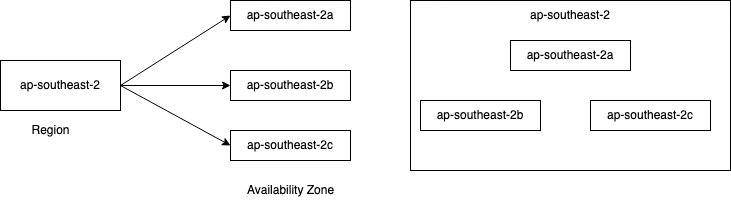

## AWS Regions
A region is a cluster of data centers deployed within a latency-defined perimeter and connected through a dedicated regional low-latency network.
- AWS has regions all around the world
- Example: us-east-1, eu-west-3
- Most services are region scoped.

### How to chose AWS regions
Some factor to choose AWS regions are:
- #### Compilance
Choose a regions that favours data governance and legal requirements. Ex. Data captured on US may not be allowed to be saved outside US, so in this case we need to choose region based on US only.
- #### Proximity
Choose a regions that is close to end users of your application.
- #### Available Services
New features and services are not available in all regions.
- #### Pricing
Pricing varies region to region and can be estimated from [here](https://calculator.aws)

---------------------------------

## AWS Availability Zone(AZ)
- Each Region has one or more discrete data center with redundant power, networking and connectivity called as Availability Zone.
- Each AZ are separated from each other, so that they are isolated for disaster.
- They are connected with hight bandwidth and ultra- low latency networking.
- Region usually has 3 Availability Zones(minimum is 2 and maximum is 6 till now)

## AWS Point of Presence
For low latency content delivery to end users Amazon has 216 Point of Presence(205 Edge locations and 11 Regions; caches) in 84 cities across 42 countries.

