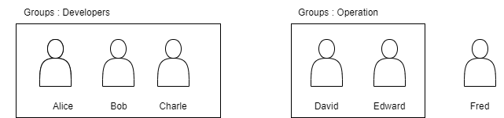
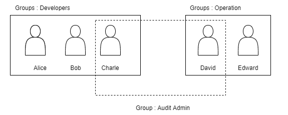

## IAM
- Abbriation for IAM is Identity and Access Management.
- Global Service
- On creating aws account, root account is created by default. Root account should not be used or shared.
- Root user should be used to create other users only and provide them access.
- User are people with in an organization and can be grouped.

- Group can only contain users, not other groups.
- Users don't have to belong to a group(not a best practice) and users can belong to multiple groups.

